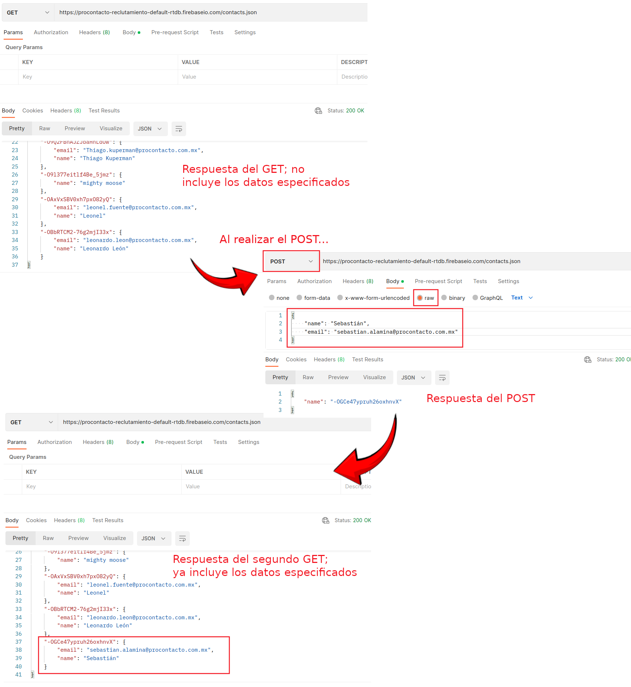
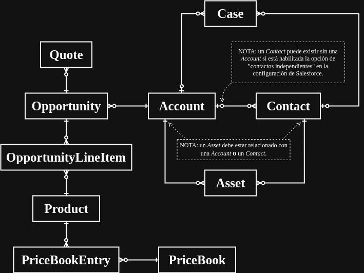

<h1 align="center">
  Evaluación práctica 📝
</h1>

</br>

<p align="center">
  <a href="https://www.procontacto.com.mx/">
    
  </a>
</p>

<p align="center">
  Evaluación práctica presentada para <strong>ProContacto</strong>...
</p>

## Tabla de contenidos :clipboard:

- [Autor](#autor-)
- [Ejercicio 2](#ejercicio-2-)
- [Ejercicio 3](#ejercicio-3-)
- [Ejercicio 4](#ejercicio-4-)
- [Ejercicio 5](#ejercicio-5-)
- [Ejercicio 6](#ejercicio-6-)
- [Ejercicio 7](#ejercicio-7-)

## Autor :bust_in_silhouette:

- [sebastianalamina](https://github.com/sebastianalamina) (Sebastián Alamina)

## Ejecución :computer:

...

## Ejercicio 2 :heavy_check_mark:

1. ¿Qué es un servidor HTTP?

   Primero, es necesario considerar que, mientras el Internet consta de la red que conecta a todas las computadoras entre sí, la World Wide Web consta de la colección de páginas web que se encuentra sobre esta red de computadoras. Así, los navegadores web utilizan Internet para acceder a la World Wide Web.

   Esta WWW utiliza el protocolo HTTP (_HyperText Transfer Protocol_); un formato preestablecido con el cual la WWW define cómo se formatean y transfieren los mensajes, y qué acciones deben realizar los servidores web y los navegadores web como respuesta a distintos comandos.

   Por lo tanto, un **servidor HTTP** es hardware y software que utiliza el protocolo HTTP para responder a peticiones de usuarios (realizadas a través de la WWW), y así poder almacenar, procesar y entregar recursos en la red.

2. ¿Qué son los verbos HTTP? Mencionar los más conocidos.

   Los servidores HTTP funcionan mediante el manejo de recursos. Los **verbos HTTP** (o _request methods_) son los métodos _personalizables_ que indican la acción que se realiza sobre estos recursos, por ejemplo:

   - El método **GET** suele buscar y recuperar recursos del servidor.
   - El método **POST** suele reemplazar un recurso del servidor por otro (o crear uno nuevo).
   - El método **PUT** suele actualizar recursos del servidor.
   - El método **DELETE** suele eliminar recursos del servidor.

3. ¿Qué es un request y un response en una comunicación HTTP? ¿Qué son los headers?

   En el protocolo HTTP, clientes y servidores se comunican entre sí mediante el envío de mensajes individuales; el mensaje enviado por el cliente es el **request** (una consulta), mientras que el mensaje enviado por el servidor como respuesta a una consulta es el **response** (una respuesta).

   Estos mensajes constan de:

   - una línea inicial (_request line_ en consultas y _status line_ en respuestas)
   - **headers** opcionales
   - una línea vacía
   - un cuerpo opcional que incluye un mensaje

   Los **headers** definen metadatos que describen al mensaje (e.g. parámetros que indican cómo manejar/operar la comunicación HTTP).

4. ¿Qué es un queryString? (En el contexto de una url)

   Una URL (_Uniform Resource Locator_) representa la dirección de un recurso único en la web.

   Así, un **query string** permite interactuar con dicho recurso al añadir ciertos valores que el servidor web utiliza antes de devolver el recurso.

   Se representan como una serie de parámetros en la URL, cada uno con su respectivo valor. Se trata de una lista de parejas tipo llave/valor separadas por el símbolo _&_.

5. ¿Qué es el responseCode? ¿Qué significado tiene los posibles valores
   devueltos?

   Los **response status codes** son códigos numéricos que envían los servidores junto con la respuesta a una consulta dada. Indican si la consulta fue completada exitosamente, o ayudan a identificar la causa de un posible problema.

   Estos códigos se dividen en 5 grupos:

   - Códigos 100 al 199 son respuestas informativas; indican que la consulta fue recibida y entendida.
   - Códigos 200 al 299 son peticiones correctas; indican que la consulta fue recibida, entendida y aceptada.
   - Códigos 300 al 399 son redirecciones; indican que el cliente debe hacer algo más para completar la consulta.
   - Códigos 400 al 499 son errores del cliente; indican que hubo un error por parte del cliente.
   - Códigos 500 al 599 son errores del servidor; indican que hubo un error por parte del servidor.

6. ¿Cómo se envía data en un _GET_ y cómo en un _POST_?

   En un **GET**, los datos se envían en la URL de la consulta (mediante los _query strings_).

   En un **POST**, los datos se envían en el cuerpo (_request body_) de la consulta.

7. ¿Qué verbo HTTP utiliza el navegador cuando accedemos a una página?

   **GET**, pues es el método que permite recuperar información de una URL.

8. Explicar brevemente qué son las estructuras de datos JSON y XML dando
   ejemplo de estructuras posibles.

   Se tratan de formatos que permiten almacenar y manipular datos de manera estructurada.

   **XML** (_eXtensible Markup Language_) no tiene tags predefinidos, por lo que permite crear los propios (por eso es _eXtensible_). Un ejemplo de una estructura XML sería la siguiente:

   ```xml
   <?xml version="1.0"?>
   <listaDeProductos title="Inventario">
       <producto>
       <nombre>Producto 1</nombre>
       <costo>$59</costo>
       <cantidad>440</cantidad>
       </producto>
       <producto>
       <nombre>Producto 2</nombre>
       <costo>$25</costo>
       <cantidad>847</cantidad>
       </producto>
       <producto>
       <nombre>Producto 3</nombre>
       <costo>$71</costo>
       <cantidad>268</cantidad>
       </producto>
   </listaDeProductos>
   ```

   **JSON** (_JavaScript Object Notation_) se integra fácilmente con JavaScript. Tiene integrado tipos/valores (objetos, arreglos, cadenas, números, booleanos y nulos) y un archivo JSON consta de uno de estos tipos. Generalmente, se utiliza un arreglo o un objeto como estructura principal (para poder almacenar más información dentro). Un ejemplo de una estructura JSON utilizando un objeto sería la siguiente:

   ```json
   {
     "llave": "valor",
     "número": 1538,
     "objeto": {
       "nombre": "José",
       "edad": 30,
       "esProgramador": true,
       "áreas": ["Realidad virtual", "Salesforce"]
     },
     "arreglo de objetos": [
       { "nombre": "objeto 1", "número": 1 },
       { "nombre": "objeto 2", "número": 2 },
       { "nombre": "objeto 3", "número": 3 }
     ]
   }
   ```

9. Explicar brevemente el estándar SOAP.

   **SOAP** (_Simple Object Access Protocol_) es un protocolo de mensajería que especifica una forma de intercambiar información estructurada en la web. Su estructura está basada en XML, y funciona mediante otros protocolos como HTTP y SMTP. Provee una forma de comunicación entre aplicaciones de diferentes sistemas operativos, diferentes tecnologías y diferentes lenguajes de programación.

   Un mensaje SOAP es un documento XML que contiene los siguientes elementos:

   - _Envelope_: Identifica al documento XML como un mensaje SOAP.
   - _Header_ (opcional): Contiene información específica de la aplicación.
   - _Body_: Contiene el mensaje.
   - _Fault_ (opcional): Contiene información de los errores y estados del mensaje. Debe incluirse dentro del elemento _Body_.

10. Explicar brevemente el estándar RESTful.

    Considerando que una arquitectura de software indica la estructura, funcionamiento y demás reglas que debe cumplir cierto software al momento de ser creado, se puede decir que REST (_REpresentational State Transfer_) es un estilo de arquitectura de software para crear APIs/servicios web **RESTful**. Está basado en HTTP, por lo que estos servicios web usan los métodos/verbos HTTP.

    Igual que el estándar SOAP, estos servicios web RESTful proveen interoperabilidad entre aplicaciones de diferentes lenguajes de programación y tecnologías, permitendo a los clientes accesar y manipular representaciones textuales de los recursos en la web.

    El estándar REST define ciertas restricciones que deben seguirse para que una API sea considerada **RESTful**...

    - La separación cliente-servidor debe ser clara.
    - Cada consulta debe contener toda la información necesaria para realizarse, sin considerar consultas o estados anteriores.
    - Para toda información enviada, debe especificarse si se puede guardar en caché o no.
    - El servidor debe estar compuesto de distintas capas, cada una con una responsabilidad única y bien definida.
    - La interfaz debe ser estandarizada; cada capa del sistema debe ser independiente.
    - Opcionalmente, el servidor puede enviar scripts de código para extender la funcionalidad del cliente.

11. ¿Qué son los headers en un request? ¿Para qué se utiliza el key Content-type en un header?

    En un request, el **header** es información que el navegador del cliente envía al servidor web. En esta información se incluyen, entre otras cosas, los detalles sobre lo que el navegador quiere y aceptará del servidor.

    También se incluye el tipo, versión y capacidades del navegador que realiza la consulta para que el servidor regrese data compatible. Así, la llave **Content-type** es un campo dentro del header que indica el tipo de medio (o contenido) del recurso que se está manipulando.

    En una _response_, la llave _Content-type_ le dice al cliente qué tipo de contenido le está devolviendo mientras que, en una _request_, la llave _Content-type_ le dice al servidor qué tipo de contenido le está enviando.

## Ejercicio 3 :heavy_check_mark:



## Ejercicio 4 :heavy_check_mark:

Se provee [enlace al perfil público de _Trailhead_](https://www.salesforce.com/trailblazer/alamina).

## Ejercicio 5 :heavy_check_mark:

### Objetos de Salesforce

1. **Lead**: Potencial cliente. Fields requeridos:

   - `Company` (string): Compañía/empresa a la cual pertenece.
   - `LastName` (string): Apellido(s) de hasta 80 caracteres.

2. **Account**: Cliente involucrado en el negocio, puede tratarse de una empresa/organización o de una persona. Fields requeridos:

   - `Name` (string): Nombre de hasta 255 caracteres.
   - `LastName` (string): Apellido(s) de hasta 80 caracteres. Requerido si se trata de una persona.

3. **Contact**: Persona específica asociada a una Account. Fields requeridos:

   - `LastName` (string): Apellido(s) de hasta 80 caracteres.

4. **Opportunity**: Venta, o trato pendiente. Fields requeridos:

   - `CloseDate` (date): Fecha en que se espera que se cierre la oportunidad.
   - `Name` (string): Nombre para la oportunidad de hasta 120 caracteres.
   - `StageName` (picklist): Etapa/fase actual de la oportunidad.

5. **Product**: Producto ofrecido por el negocio. Fields requeridos:

   - `Name` (string): Nombre del producto.

6. **PriceBook**: Lista de productos (y precios) ofrecidos por el negocio. Fields requeridos:

   - `Name` (string): Nombre de la lista.

7. **Quote**: Precios propuestos para un producto o servicio. Fields requeridos:

   - `Name` (string): Nombre de hasta 255 caracteres.

8. **Asset**: Bien que ha sido adquirido. Fields requeridos:

   - `AccountId` (reference): ID de la Account asociada. Requerido si no se especifica `ContactId`.
   - `ContactId` (reference): ID del Contact asociado. Requerido si no se especifica `AccountId`.
   - `Name` (string): Nombre del bien.

9. **Case**: Un caso, es decir, un problema, solicitud, o retroalimentación de algún cliente. Fields requeridos:

   - `ServiceContractId` (reference): ID del `ServiceContract` asociado. Requerido sólo bajo ciertos criterios.
   - `SuppliedEmail` (email): Correo electrónico introducido al crear el caso. Requerido sólo bajo ciertos criterios.

10. **Article**: Artículo (pieza de contenido) parte de la base de conocimientos del negocio.

### Diagrama de relaciones

En el siguiente diagrama se relacionan los objetos aquí descritos. A considerar:

- Las 3 ramitas indican la relación a muchos (N).
- La línea paralela al objeto indica la relación a uno (1).
- El círculo sin relleno indica una relación no obligatoria (opcional).



## Ejercicio 6 :heavy_check_mark:

<style type="text/css">
  h3 + ol { list-style-type: upper-alpha; }
</style>

### Soluciones de Salesforce

1. ¿Qué es Salesforce?

   Software CRM; ayuda a sus usuarios a administrar su relación con sus clientes al proveer herramientas en la nube cuyos accesos están bien definidos y que permiten, entre otras cosas, trabajar con clientes potenciales, organizar tareas y pendientes, y colaborar en equipo.

   Además, provee tecnologías específicas como una plataforma de colaboración (similar a una red social), integración con IA, análisis de datos, generación de estadísticas, etc.

2. ¿Qué es Sales Cloud?

   Una plataforma enfocada en la gestión de ventas; ayuda a mejorar la eficiencia y la eficacia de las actividades comerciales al proveer análisis detallados de ventas, predecir ventas futuras, automatizar procesos y flujos de trabajo, gestionar leads, accounts, opportunities, etc. Cabe destacar que permite un alto nivel de personalización.

3. ¿Qué es Service Cloud?

   Software de servicio de atención al cliente integrado con IA. Optimiza el flujo de atención con ayuda de IA, que automatiza las interacciones menos importantes, provee recomendaciones a los agentes, etc. Y le brinda a los agentes, en un mismo lugar, todas las herramientas necesarias para llevar un mejor control del flujo.

4. ¿Qué es Health Cloud?

   Software CRM enfocado al sector de salud. Guía a los usuarios en los procesos para servirse de sus beneficios, brinda a los equipos profesionales información integral sobre sus pacientes, facilita la comunicación entre ambos, monitorea a pacientes mediante la recolección y análisis de datos, etc.

5. ¿Qué es Marketing Cloud?

   Una plataforma con énfasis en el marketing. Contextualiza datos para que éstos puedan ser explotados en favor del crecimiento de las empresas, optimiza tiempos al generar contenido y analizar estadísticas con ayuda de IA, auxilia en procesos de ejecución de campañas de marketing, entre otras cosas.

### Funcionalidades de Salesforce

1. ¿Qué es un RecordType?

   Objeto que permite agrupar records. Así, records de un mismo objeto pueden tener diferentes Page Layouts, fields, fields obligatorios, e incluso valores en listas picklist.

2. ¿Qué es un ReportType?

   Un template que especifica detalladamente qué objetos, relaciones y fields incluir en un reporte.

3. ¿Qué es un Page Layout?

   Una especificación del diseño y disposición/organización de los botones, fields, listas de objetos relacionados, y demás funcionalidades, para las páginas de un objeto dado (donde se administran sus records).

4. ¿Qué es un Compact Layout?

   Una especificación de los fields a mostrar en el panel de highlights (parte superior de la página) de los records, así como en otros lugares relevantes, como en el card que se muestra al colocar el cursor sobre un hipervínculo a un record.

5. ¿Qué es un Perfil?

   Objeto que representa un conjunto de permisos mediante fields booleanos llamados _PermissionsNombreDelPermiso_. Inicialmente, tiene los permisos habilitados indicados por algún _UserLicenseId_ asociado.

6. ¿Qué es un Rol?

   Los usuarios tienen acceso a records que le pertenecen a, o que son compartidos con, usuarios cuyo rol sea [inferior](https://help.salesforce.com/s/articleView?id=platform.admin_roles.htm&type=5) dentro de su jerarquía de roles.

7. ¿Qué es un Validation Rule?

   Reglas personalizables que se definen sobre objetos para verificar datos ingresados en un record antes de que éste sea guardado. Se trata de fórmulas/expresiones que trabajan con datos en uno o más fields, y devuelven un booleano. También pueden incluir un mensaje de error a imprimirse en caso de que la regla devuelva un [True](https://help.salesforce.com/s/articleView?id=platform.fields_defining_field_validation_rules.htm&type=5).

8. ¿Qué diferencia hay entre una relación Master Detail y Lookup?

   Las relaciones Lookup son débiles ("opcionales"), mientras que las relaciones Master-Detail son fuertes; en estas últimas hay herencia de permisos, y eliminar un registro padre elimina también sus registros hijos asociados.

9. ¿Qué es un Sandbox?

   Un entorno de pruebas aislado (no afecta otras instancias) que permite desarrollar y probar configuraciones o código.

10. ¿Qué es un ChangeSet?

    Un conjunto de cambios/personalizaciones sobre el menú Setup que pueden ser enviadas de una org a otra. Por ejemplo, se pueden probar ciertos cambios en una org de sandbox/desarrollo para después enviarlos a una org de producción.

11. ¿Para qué sirve el import Wizard de Salesforce?

    Para importar hasta 50,000 records (cada vez que se usa) de Accounts, Contacts, Leads, Solutions y Custom Objects.

12. ¿Para qué sirve la funcionalidad Web to Lead?

    Para capturar datos de un usuario visitante a través de la Web, y almacenarlos como un cliente potencial (Lead).

13. ¿Para qué sirve la funcionalidad Web to Case?

    Para capturar datos provistos por algún usuario a través de la Web, que consisten en preguntas, retroalimentación o problemas (Cases).

14. ¿Para qué sirve la funcionalidad Omnichannel?

    Para brindar una vista unificada y optimizada de servicio al cliente. A diferencia de un enfoque multi-canal, en el enfoque omni-canal no importa a través de qué canal estableció comunicación el cliente, pues la administración de solicitudes es la misma para el agente de servicio.

15. ¿Para qué sirve la funcionalidad Chatter?

    Para conectar y motivar usuarios a colaborar y trabajar de forma eficiente en la organización independientemente de su función o ubicación; les brinda noticias en tiempo real, perfiles, grupos y más, para compartir información, colaborar y mantenerse informados de las últimas actualizaciones en su empresa.

### Conceptos generales

1. ¿Qué significa SaaS?

   _Software as a Service_ es una forma de brindar aplicaciones (software) a través del Internet, como si se tratara de un servicio por el cual generalmente se realiza un pago, ya sea único o periódico.

2. ¿Salesforce es Saas?

   Debido al extenso conjunto de aplicaciones (software) que brinda Salesforce a través de Internet, se puede decir que se trata de una solución SaaS. Sin embargo, al proveer una plataforma de desarrollo para customización de estas aplicaciones, también se trata de una solución PaaS (_Platform as a Service_).

3. ¿Qué significa que una solución sea Cloud?

   Que se encuentra en la nube/Internet. Es decir, que está ejecutándose en servidores (ordenadores/hardware que se mantienen en funcionamiento la mayor parte del tiempo), generalmente provistos por algún proveedor/host que la empresa contrata.

4. ¿Qué significa que una solución sea On-Premise?

   Que se encuentra en las instalaciones. Es decir, que está ejecutándose en los ordenadores (o infraestructura de hardware) de la misma empresa; de manera local.

5. ¿Qué es un pipeline de ventas?

   La definición de un flujo de ventas; representa las diferentes etapas por las que pasa un Lead para adquirir algún producto o servicio. Este concepto define también toda la secuencia de acciones y estrategias que los equipos de marketing y ventas deben adoptar para asegurar el éxito del proceso.

6. ¿Qué es un funnel de ventas?

   La representación del proceso de cierre de un negocio; del acompañamiento de un cliente desde el momento en que tiene el primer contacto con los productos o servicios hasta el momento en que la venta es cerrada. Visualmente, se representa mediante un embudo (funnel) divido en las etapas que sigue el cliente.

7. ¿Qué significa Customer Experience?

   Es la impresión/experiencia que se lleva un cliente al interactuar con un servicio/producto/equipo/etc.

8. ¿Qué significa omnicanalidad?

   Es la estrategia de integrar y alinear todos los canales de comunicación disponibles de un servicio, a través de un solo punto de gestión.

9. ¿Qué significa que un negocio sea B2B? ¿Qué significa que un negocio sea B2C? ¿Qué es un KPI?

   Un negocio _Business-to-Business_ (B2B) implementa transacciones comerciales dirigidas a otros negocios, mientras que un negocio _Business-to-Customer_ (B2C) las dirige a los consumidores finales.

   Un KPI (_Key Performance Indicator_) es una medición cuantificable que ayuda con el seguimiento del progreso que lleva una empresa hacia algún objetivo a través de un periodo fijo de tiempo. Ayuda a las empresas a establecer metas, monitorear logros, e identificar áreas de oportunidad.

10. ¿Qué es una API y en qué se diferencia de una Rest API?

    Una API (_Application Programming Interface_) es una interfaz que define la comunicación entre diferentes ordenadores o programas/aplicaciones.

    Una API REST es un tipo de API que sigue un conjunto de reglas y estándares bien definidos que la hacen más fácil de usar, y más compatible con otras aplicaciones.

11. ¿Qué es un Proceso Batch?

    Es la ejecución de una tarea que trabaja con un lote (batch) de datos. Estos procesos incluyen elaboración de respaldos, filtrado y ordenamiento de datos, etc. Generalmente son tareas repetitivas y que consumen mucho esfuerzo de cómputo (en tiempo y/o espacio), por lo que suelen ejecutarse cuando no hay mucha demanda de recursos.

12. ¿Qué es Kanban?

    Una metodología ágil para gestionar tareas de manera óptima al supervisar el flujo de trabajo desde el inicio (definición de una tarea) hasta el final (finalización de la tarea). Se apoya del uso de cards (板 - ban) visuales (看 - kan) que representan tareas y su estado actual.

13. ¿Qué es un ERP?

    _Enterprise Resource Planning_ (ERP) es software que integra y gestiona diversas áreas de una empresa (finanzas, recursos humanos, inventarios, etc.) en un mismo sistema, para mejorar la eficiencia y optimizar los procesos internos de un negocio.

14. ¿Salesforce es un ERP?

    No. Si bien Salesforce ofrece soluciones para empresas que pueden integrarse con un ERP, no provee como tal un producto ERP, pues Salesforce no se enfoca en conectar sistemas financieros y operacionales en una base de datos central, sino en gestionar las interacciones con los clientes.

## Ejercicio 7 :heavy_check_mark:
